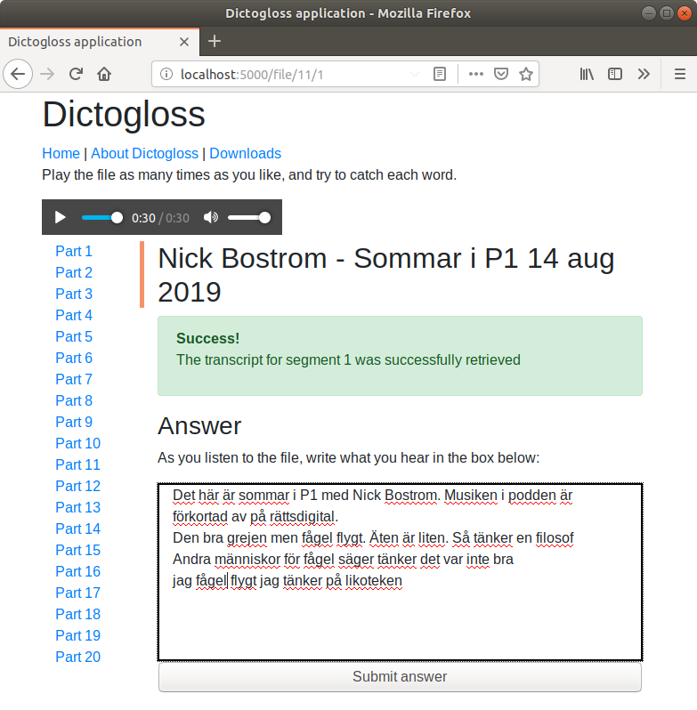
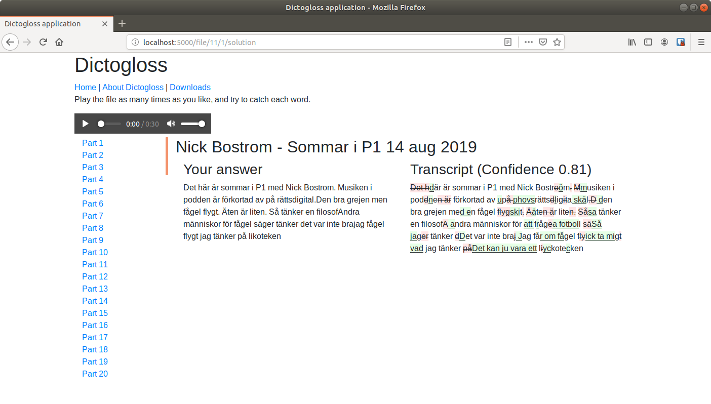

# Dictogloss App

This is an application for practicing a foreign language using a variant of the ["dictogloss technique"](https://en.wikipedia.org/wiki/Dictogloss).
There are different reasons/approaches with this technique, but I found it incredibly useful for understanding people speaking
in real Swedish. I believe that it is often also used as a means of teaching grammatical constructs as well.
The flow of the application is as follows:

1. A link to an MP3 is provided, which is downloaded and split into segments of 30s each.
2. The segment is played over and over, and the text is written into the text box on the page.  

3. The answer is submitted, and is then compared with the transcript of the segment, obtained using the  Google Speech API.

## Warning

At present, this app is not hosted anywhere.  It is **strongly** suggested that you only bind to `127.0.0.1`, as
otherwise anyone will be able to use your API credentials (and therefore your associated billing account) to transcribe
any speech that they like.

## Prerequisites

To obtain the transcript of the application and compare with an answer, this application will require a Google Cloud
account, with the Speech-to-text enabled.

NOTE: The Google API is free for the first sixty minutes of audio transcribed, but after that will cost as documented
on the Google Cloud Speech-to-Text [Documentation](https://cloud.google.com/speech-to-text/pricing).

The app can probably run without that, if you only need to download/store a file, and split into segments.

It has been tested on Ubuntu 18.04 with Python 3.6.  It will probably work on Windows, and might work with Python 2 (unlikely)
but no support will be given for those.

## Authentication

To set up the Google Cloud Speech API, follow the [instructions for authentication](https://cloud.google.com/speech-to-text/docs/reference/libraries#setting_up_authentication).

## Setup with Docker

This app is stored in the Docker Hub at https://hub.docker.com/r/huwf/dictogloss and can be retrieved as follows:

    docker pull huwf/dictogloss
    
You will need to mount the API key to the docker container. The code is stored at `/usr/src`, so the easiest is to mount
the file from the host to `/usr/src/API_KEY.json`.

Depending on your setup, you will probably want to mount the mp3 directory to host, and the sqlite file (if appropriate).
By default this is `database.db`.

It runs using the Flask development server on port 5000, so can be run as:

    docker run -v $(pwd)/database.db:/usr/src/database.db -v $(pwd)/API_KEY.json:/usr/src/API_KEY.json -v $(pwd)/static/mp3:/usr/src/static/mp3 -p 127.0.0.1:5000:5000 huwf/dictogloss

Alternative settings for the Flask server can also be set as arguments.

      
## Setup on your computer

Install the dependencies using the command:

    pip install -r requirements.txt 

After you've saved the JSON file you get from setting up the requirements, set the `GOOGLE_APPLICATION_CREDENTIALS` environment
variable to the location you have saved the file, e.g.,

    export GOOGLE_APPLICATION_CREDENTIALS = API_KEY.json
    
To run the application:
    
    export FLASK_APP = app    
    python -u -m flask 
    
## Customisation

Limited customisation can be done through environment variables:

* Flask environment variables can be configured in the usual way according to the [Flask documentation](https://flask.palletsprojects.com/en/1.1.x)
* You can change the database connection string to use a different server by modifying the `DB_CONNECTION_STRING` environment variable.

